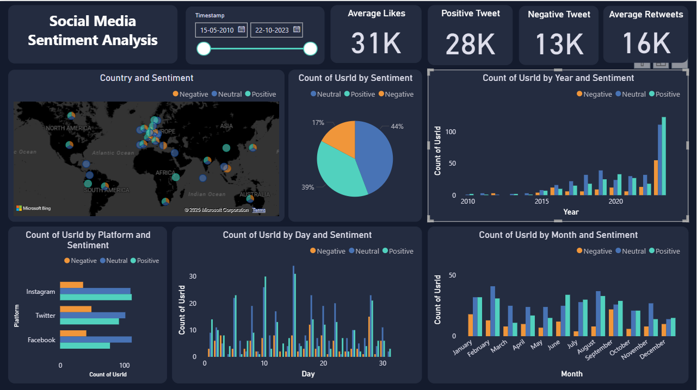

# 📊 Social Media Sentiment Analysis Project

## 📌 Overview
This project performs **Sentiment Analysis** on Twitter data using **Python, NLP (Natural Language Processing), NLTK, and WordCloud** for text cleaning, preprocessing, and visualization. The cleaned dataset is later integrated with **Power BI** for interactive dashboards, KPIs, and sentiment-based insights.  

The model classifies user sentiment as:  
- ✅ **Positive** – When the tweet expresses a favorable or happy tone.  
- ❌ **Negative** – When the tweet reflects criticism, dislike, or anger.  
- ⚪ **Neutral** – When the tweet is objective, balanced, or lacks emotion.  

---
## ⚙️ Features
- Text Cleaning & Preprocessing (`Clean_Text` column created).  
- Tokenization, Stopwords removal, and Lemmatization using **NLTK**.  
- Frequency distribution of common positive and negative words.  
- WordCloud visualizations for sentiment-specific terms.  
- Sentiment distribution analysis (Positive %, Negative %, Neutral).  
- KPIs and Slicers in **Power BI**:  
  -  Positive % → `(COUNT of Positive Sentiment / Total Tweets) * 100`  
  -  Negative % → `(COUNT of Negative Sentiment / Total Tweets) * 100`  
  -  Average Likes  
  -  Average Retweets  
- Time-based filtering (Year, Month, Day, Hour).  
- Dashboard with sentiment-wise trends and visualizations.  

---

## 🛠️ Tech Stack
- **Programming Language**: Python (Pandas, Matplotlib, Seaborn)  
- **Libraries**:  
  - [NLTK](https://www.nltk.org/) → Text preprocessing, stopwords, tokenization.  
  - [WordCloud](https://pypi.org/project/wordcloud/) → Visualizing frequent words.  
  - [Counter](https://docs.python.org/3/library/collections.html#collections.Counter) → Counting common words.  
- **Visualization**: Matplotlib, Seaborn, WordCloud  
- **Dashboarding**: Microsoft Power BI  

---

## 📊 Dashboard 
  
*(Replace with the actual path to your screenshot in the repo)*  

---

## 🔎 Methodology  

### 1. Data Preprocessing
- Dropped unnecessary columns (`Text` replaced with `Clean_Text`).  
- Converted Sentiment labels to lower case (`positive`, `negative`, `neutral`).  
- Tokenized tweets into lists (`temp_list`).  
- Removed stopwords and special characters.  
- Lemmatized words for normalization.  

### 2. Sentiment Analysis
- Count of tweets by sentiment.  
- Positive vs Negative vs Neutral %.  
- Word frequency analysis using `Counter`.  

### 3. Visualization
- **WordCloud** for Positive & Negative tweets.  
- **Bar Charts** for most common words by sentiment.  
- **Stacked Bar Charts** in Power BI for time-based sentiment.  

### 4. Dashboard in Power BI
- KPIs: Positive %, Negative %, Average Likes, Average Retweets.  
- Filters (Slicers): Year, Month, Day, Hour, Country, Platform, Hashtags.  
- Sentiment trends with likes & retweets.  

---

## 📊 Example Visualizations  

### ✅ WordCloud for Positive Tweets
```python
from wordcloud import WordCloud
import matplotlib.pyplot as plt

words = ' '.join(
    [item for sublist in df[df['Sentiment'].str.lower() == 'positive']['temp_list'] for item in sublist]
)
wordcloud = WordCloud(width=800, height=400, background_color='white').generate(words)

plt.figure(figsize=(10, 6))
plt.imshow(wordcloud, interpolation='bilinear')
plt.axis("off")
plt.show()
